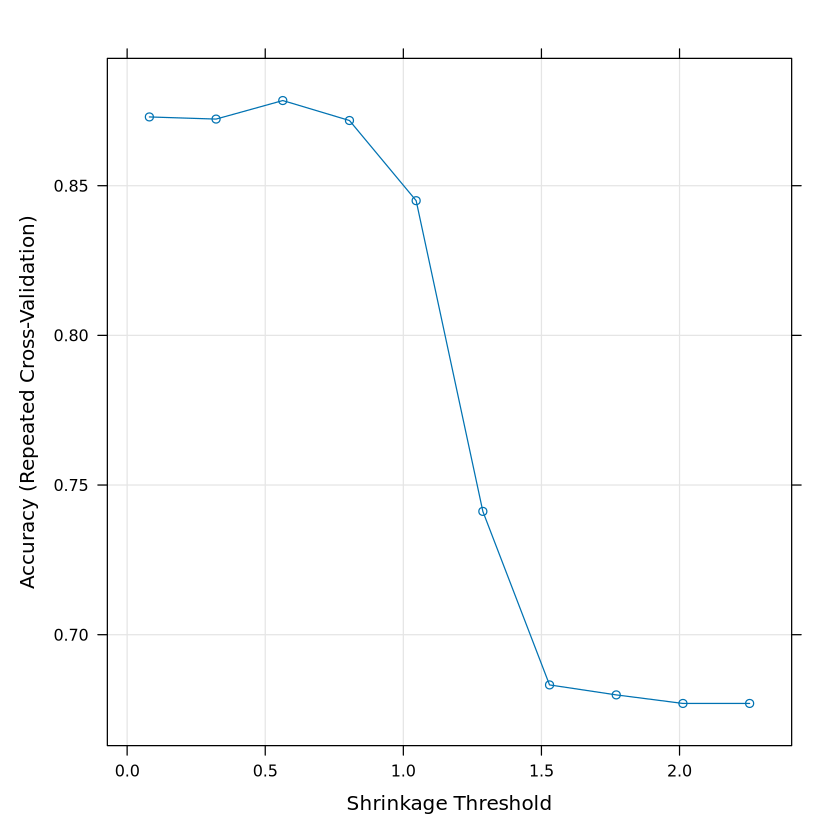

```python
install.packages("IRkernel")
IRkernel::installspec()
```


      Cell In[1], line 2
        IRkernel::installspec()
                 ^
    SyntaxError: invalid syntax


```python
library(MLSeq)
library(tximport)
library(tidyverse)
library(DESeq2)
set.seed(1111)
```


    ---------------------------------------------------------------------------

    NameError                                 Traceback (most recent call last)

    Cell In[1], line 1
    ----> 1 library(MLSeq)
          2 library(tximport)
          3 library(tidyverse)


    NameError: name 'library' is not defined


```python
counts_dir = "../counts/"
counts_files = list.files(counts_dir, pattern = "*.tsv")
```


```python
sample_table = tibble(fileName = counts_files,
                      sampleName = counts_files,
                      condition = ifelse(str_detect(fileName, "A[0-9]+"), "A", "H") %>% factor(levels = c("H", "A")))
sample_table %>% head
```


<table class="dataframe">
<caption>A tibble: 6 × 3</caption>
<thead>
	<tr><th scope=col>fileName</th><th scope=col>sampleName</th><th scope=col>condition</th></tr>
	<tr><th scope=col>&lt;chr&gt;</th><th scope=col>&lt;chr&gt;</th><th scope=col>&lt;fct&gt;</th></tr>
</thead>
<tbody>
	<tr><td>SRR26050650_GSM7778640_H16_miRNA-seq_Homo_sapiens_miRNA-Seq.tsv</td><td>SRR26050650_GSM7778640_H16_miRNA-seq_Homo_sapiens_miRNA-Seq.tsv</td><td>H</td></tr>
	<tr><td>SRR26050651_GSM7778639_H25_miRNA-seq_Homo_sapiens_miRNA-Seq.tsv</td><td>SRR26050651_GSM7778639_H25_miRNA-seq_Homo_sapiens_miRNA-Seq.tsv</td><td>H</td></tr>
	<tr><td>SRR26050652_GSM7778638_H24_miRNA-seq_Homo_sapiens_miRNA-Seq.tsv</td><td>SRR26050652_GSM7778638_H24_miRNA-seq_Homo_sapiens_miRNA-Seq.tsv</td><td>H</td></tr>
	<tr><td>SRR26050653_GSM7778637_H22_miRNA-seq_Homo_sapiens_miRNA-Seq.tsv</td><td>SRR26050653_GSM7778637_H22_miRNA-seq_Homo_sapiens_miRNA-Seq.tsv</td><td>H</td></tr>
	<tr><td>SRR26050654_GSM7778636_H21_miRNA-seq_Homo_sapiens_miRNA-Seq.tsv</td><td>SRR26050654_GSM7778636_H21_miRNA-seq_Homo_sapiens_miRNA-Seq.tsv</td><td>H</td></tr>
	<tr><td>SRR26050655_GSM7778635_H20_miRNA-seq_Homo_sapiens_miRNA-Seq.tsv</td><td>SRR26050655_GSM7778635_H20_miRNA-seq_Homo_sapiens_miRNA-Seq.tsv</td><td>H</td></tr>
</tbody>
</table>


```python
ddsHTSeq <- DESeqDataSetFromHTSeqCount(sampleTable = sample_table,
                                       directory = counts_dir,
                                       design= ~ condition)
ddsHTSeq
```


    class: DESeqDataSet 
    dim: 63187 49 
    metadata(1): version
    assays(1): counts
    rownames(63187): ENSG00000000003.16 ENSG00000000005.6 ...
      ENSG00000293559.1 ENSG00000293560.1
    rowData names(0):
    colnames(49):
      SRR26050650_GSM7778640_H16_miRNA-seq_Homo_sapiens_miRNA-Seq.tsv
      SRR26050651_GSM7778639_H25_miRNA-seq_Homo_sapiens_miRNA-Seq.tsv ...
      SRR26050697_GSM7778593_A6_miRNA-seq_Homo_sapiens_miRNA-Seq.tsv
      SRR26050698_GSM7778592_A1_miRNA-seq_Homo_sapiens_miRNA-Seq.tsv
    colData names(1): condition


```python
count_data = counts(ddsHTSeq)
vars <- sort(apply(count_data, 1, var, na.rm = TRUE), decreasing = TRUE)
data <- count_data[names(vars)[1:100], ]
nTest <- ceiling(ncol(data) * 0.3)
ind <- sample(ncol(data), nTest, FALSE)
class = sample_table %>% transmute(condition)
data %>% head()
```


<table class="dataframe">
<caption>A matrix: 6 × 49 of type int</caption>
<thead>
	<tr><th></th><th scope=col>SRR26050650_GSM7778640_H16_miRNA-seq_Homo_sapiens_miRNA-Seq.tsv</th><th scope=col>SRR26050651_GSM7778639_H25_miRNA-seq_Homo_sapiens_miRNA-Seq.tsv</th><th scope=col>SRR26050652_GSM7778638_H24_miRNA-seq_Homo_sapiens_miRNA-Seq.tsv</th><th scope=col>SRR26050653_GSM7778637_H22_miRNA-seq_Homo_sapiens_miRNA-Seq.tsv</th><th scope=col>SRR26050654_GSM7778636_H21_miRNA-seq_Homo_sapiens_miRNA-Seq.tsv</th><th scope=col>SRR26050655_GSM7778635_H20_miRNA-seq_Homo_sapiens_miRNA-Seq.tsv</th><th scope=col>SRR26050656_GSM7778634_H19_miRNA-seq_Homo_sapiens_miRNA-Seq.tsv</th><th scope=col>SRR26050657_GSM7778633_H15_miRNA-seq_Homo_sapiens_miRNA-Seq.tsv</th><th scope=col>SRR26050658_GSM7778632_H14_miRNA-seq_Homo_sapiens_miRNA-Seq.tsv</th><th scope=col>SRR26050659_GSM7778631_H11_miRNA-seq_Homo_sapiens_miRNA-Seq.tsv</th><th scope=col>⋯</th><th scope=col>SRR26050689_GSM7778601_A57_miRNA-seq_Homo_sapiens_miRNA-Seq.tsv</th><th scope=col>SRR26050690_GSM7778600_A53_miRNA-seq_Homo_sapiens_miRNA-Seq.tsv</th><th scope=col>SRR26050691_GSM7778599_A45_miRNA-seq_Homo_sapiens_miRNA-Seq.tsv</th><th scope=col>SRR26050692_GSM7778598_A43_miRNA-seq_Homo_sapiens_miRNA-Seq.tsv</th><th scope=col>SRR26050693_GSM7778597_A41_miRNA-seq_Homo_sapiens_miRNA-Seq.tsv</th><th scope=col>SRR26050694_GSM7778596_A38_miRNA-seq_Homo_sapiens_miRNA-Seq.tsv</th><th scope=col>SRR26050695_GSM7778595_A33_miRNA-seq_Homo_sapiens_miRNA-Seq.tsv</th><th scope=col>SRR26050696_GSM7778594_A27_miRNA-seq_Homo_sapiens_miRNA-Seq.tsv</th><th scope=col>SRR26050697_GSM7778593_A6_miRNA-seq_Homo_sapiens_miRNA-Seq.tsv</th><th scope=col>SRR26050698_GSM7778592_A1_miRNA-seq_Homo_sapiens_miRNA-Seq.tsv</th></tr>
</thead>
<tbody>
	<tr><th scope=row>ENSG00000203875.13</th><td>129855</td><td>467665</td><td>296412</td><td>450115</td><td>567858</td><td>256402</td><td>627122</td><td>436312</td><td>604883</td><td>428692</td><td>⋯</td><td>1546</td><td>497993</td><td>258142</td><td>89962</td><td>81885</td><td>121426</td><td>557496</td><td>156393</td><td>341195</td><td>254670</td></tr>
	<tr><th scope=row>ENSG00000234741.10</th><td> 19797</td><td> 40089</td><td>112253</td><td> 53349</td><td> 65259</td><td> 27183</td><td> 69796</td><td> 54086</td><td> 73212</td><td> 44482</td><td>⋯</td><td> 431</td><td>142708</td><td>122798</td><td>24545</td><td>18502</td><td> 20593</td><td>176802</td><td> 35555</td><td> 61034</td><td> 72091</td></tr>
	<tr><th scope=row>ENSG00000199994.1</th><td> 33574</td><td> 68006</td><td>  6702</td><td> 29152</td><td> 28626</td><td> 11039</td><td> 59479</td><td> 68842</td><td> 44653</td><td> 68226</td><td>⋯</td><td> 130</td><td> 77426</td><td> 69695</td><td>47562</td><td>92173</td><td> 50793</td><td> 39813</td><td> 69631</td><td> 45569</td><td> 11419</td></tr>
	<tr><th scope=row>ENSG00000201098.1</th><td> 46814</td><td> 17290</td><td>  6314</td><td> 56657</td><td> 27594</td><td> 15706</td><td> 51784</td><td> 40354</td><td> 32474</td><td> 54054</td><td>⋯</td><td> 211</td><td> 42722</td><td>150207</td><td>34064</td><td>63255</td><td> 54655</td><td>153791</td><td>149356</td><td> 51208</td><td> 30389</td></tr>
	<tr><th scope=row>ENSG00000199753.1</th><td>  9827</td><td> 49099</td><td> 60493</td><td> 36925</td><td> 37107</td><td> 16598</td><td> 53433</td><td> 33010</td><td> 46459</td><td> 25344</td><td>⋯</td><td> 224</td><td>126155</td><td> 15828</td><td>13604</td><td>26182</td><td>  9529</td><td> 36791</td><td> 16435</td><td> 55171</td><td> 25360</td></tr>
	<tr><th scope=row>ENSG00000207031.1</th><td> 11639</td><td> 24187</td><td> 19920</td><td> 46503</td><td> 69740</td><td> 26458</td><td> 68551</td><td> 54512</td><td> 55957</td><td> 44977</td><td>⋯</td><td> 135</td><td> 60252</td><td> 45969</td><td>10218</td><td> 5495</td><td>  9873</td><td> 75708</td><td> 22145</td><td> 34473</td><td> 35104</td></tr>
</tbody>
</table>


```python
# Minimum count is set to 1 in order to prevent 0 division problem within
# classification models.
data.train <- as.matrix(data[ ,-ind] + 1)
data.test <- as.matrix(data[ ,ind] + 1)
classtr <- class[-ind, ]
classts <- class[ind, ]
```


```python
data.trainS4 = DESeqDataSetFromMatrix(countData = data.train, colData = classtr,
design = formula(~condition))
data.testS4 = DESeqDataSetFromMatrix(countData = data.test, colData = classts,
design = formula(~condition))
```

    converting counts to integer mode
    
    converting counts to integer mode
    


```python
# Nearest shrunken centroids
fit.NSC <- classify(data = data.trainS4, method = "pam",
preProcessing = "deseq-vst", ref = "H", tuneLength = 10,
control = trainControl(method = "repeatedcv", number = 5,
repeats = 10, classProbs = TRUE))
show(fit.NSC)
trained(fit.NSC)
plot(fit.NSC)
```

    gene-wise dispersion estimates
    
    mean-dispersion relationship
    
    final dispersion estimates
    


    123456789101112131415161718192021222324252627282930111111111111111111111111111111111111111111111111111
      An object of class "MLSeq"
      Model Description: Nearest Shrunken Centroids (pam)
    
                Method  :  pam 
    
           Accuracy(%)  :  88.24 
        Sensitivity(%)  :  81.82 
        Specificity(%)  :  91.3 
    
      Reference Class   :  H 
    


    Nearest Shrunken Centroids 
    
     34 samples
    100 predictors
      2 classes: 'H', 'A' 
    
    No pre-processing
    Resampling: Cross-Validated (5 fold, repeated 10 times) 
    Summary of sample sizes: 27, 28, 26, 27, 28, 27, ... 
    Resampling results across tuning parameters:
    
      threshold   Accuracy   Kappa     
      0.08049286  0.8729762  0.72976232
      0.32197143  0.8722619  0.72617808
      0.56345000  0.8784524  0.73323035
      0.80492858  0.8717857  0.71029056
      1.04640715  0.8450000  0.62969743
      1.28788573  0.7411905  0.26594096
      1.52936430  0.6832143  0.04769711
      1.77084287  0.6798810  0.01176471
      2.01232145  0.6770238  0.00000000
      2.25380002  0.6770238  0.00000000
    
    Accuracy was used to select the optimal model using the largest value.
    The final value used for the model was threshold = 0.56345.


    

    


```python
# All methods
availableMethods()
```


<style>
.list-inline {list-style: none; margin:0; padding: 0}
.list-inline>li {display: inline-block}
.list-inline>li:not(:last-child)::after {content: "\00b7"; padding: 0 .5ex}
</style>
<ol class=list-inline><li>'amdai'</li><li>'AdaBag'</li><li>'treebag'</li><li>'bagFDA'</li><li>'bayesglm'</li><li>'gamboost'</li><li>'glmboost'</li><li>'BstLm'</li><li>'LogitBoost'</li><li>'bstSm'</li><li>'blackboost'</li><li>'bstTree'</li><li>'C5.0'</li><li>'rpart'</li><li>'rpart1SE'</li><li>'rpart2'</li><li>'rpartScore'</li><li>'cforest'</li><li>'ctree'</li><li>'ctree2'</li><li>'C5.0Cost'</li><li>'rpartCost'</li><li>'deepboost'</li><li>'dda'</li><li>'dwdPoly'</li><li>'dwdRadial'</li><li>'fda'</li><li>'gam'</li><li>'glm'</li><li>'gpls'</li><li>'glmnet'</li><li>'protoclass'</li><li>'hda'</li><li>'hdda'</li><li>'hdrda'</li><li>'kknn'</li><li>'knn'</li><li>'svmLinearWeights2'</li><li>'svmLinear3'</li><li>'lvq'</li><li>'lda'</li><li>'lda2'</li><li>'stepLDA'</li><li>'dwdLinear'</li><li>'loclda'</li><li>'Mlda'</li><li>'mda'</li><li>'avNNet'</li><li>'mlp'</li><li>'mlpWeightDecay'</li><li>'mlpWeightDecayML'</li><li>'mlpML'</li><li>'earth'</li><li>'gcvEarth'</li><li>'nb'</li><li>'nbDiscrete'</li><li>'pam'</li><li>'nnet'</li><li>'pcaNNet'</li><li>'ORFlog'</li><li>'ORFpls'</li><li>'ORFridge'</li><li>'ORFsvm'</li><li>'pls'</li><li>'pda'</li><li>'PenalizedLDA'</li><li>'plr'</li><li>'multinom'</li><li>'qda'</li><li>'stepQDA'</li><li>'rbf'</li><li>'rf'</li><li>'rda'</li><li>'rlda'</li><li>'RRF'</li><li>'Linda'</li><li>'rmda'</li><li>'QdaCov'</li><li>'rrlda'</li><li>'bdk'</li><li>'sdwd'</li><li>'sparseLDA'</li><li>'spls'</li><li>'gbm'</li><li>'svmLinear'</li><li>'svmPoly'</li><li>'svmRadial'</li><li>'voomDLDA'</li><li>'voomDQDA'</li><li>'voomNSC'</li><li>'PLDA'</li><li>'PLDA2'</li><li>'NBLDA'</li></ol>


```python
# Define control lists.
ctrl.continuous <- trainControl(method = "repeatedcv", number = 5, repeats = 10)
ctrl.discrete <- discreteControl(method = "repeatedcv", number = 5, repeats = 10,
tuneLength = 10)

# 1. Continuous classifiers, SVM and NSC
# fit.svm <- classify(data = data.trainS4, method = "svmRadial",
# preProcessing = "deseq-vst", ref = "H", tuneLength = 10,
# control = ctrl.continuous)
fit.NSC <- classify(data = data.trainS4, method = "pam",
preProcessing = "deseq-vst", ref = "H", tuneLength = 10,
control = ctrl.continuous)
# 2. Discrete classifiers
fit.plda <- classify(data = data.trainS4, method = "PLDA", normalize = "deseq",
ref = "H", control = ctrl.discrete)
fit.plda2 <- classify(data = data.trainS4, method = "PLDA2", normalize = "deseq",
ref = "H", control = ctrl.discrete)
fit.nblda <- classify(data = data.trainS4, method = "NBLDA", normalize = "deseq",
ref = "H", control = ctrl.discrete)

# 4. Predictions
# pred.svm <- predict(fit.svm, data.testS4)
pred.NSC <- predict(fit.NSC, data.testS4)
```

    gene-wise dispersion estimates
    
    mean-dispersion relationship
    
    final dispersion estimates
    


    123456789101112131415161718192021222324252627282930111111111111111111111111111111111111111111111111111

    variance of dispersion residuals not estimated (necessary only for differential expression calling)
    


```python
# Check predictions
pred.NSC <- relevel(pred.NSC, ref = "H")
actual <- relevel(classts$condition, ref = "H")
tbl <- table(Predicted = pred.NSC, Actual = actual)
confusionMatrix(tbl, positive = "H")

```


    Confusion Matrix and Statistics
    
             Actual
    Predicted  H  A
            H  4  0
            A  0 11
                                        
                   Accuracy : 1         
                     95% CI : (0.782, 1)
        No Information Rate : 0.7333    
        P-Value [Acc > NIR] : 0.009539  
                                        
                      Kappa : 1         
                                        
     Mcnemar's Test P-Value : NA        
                                        
                Sensitivity : 1.0000    
                Specificity : 1.0000    
             Pos Pred Value : 1.0000    
             Neg Pred Value : 1.0000    
                 Prevalence : 0.2667    
             Detection Rate : 0.2667    
       Detection Prevalence : 0.2667    
          Balanced Accuracy : 1.0000    
                                        
           'Positive' Class : H         
                                        


```python
# Some methods allow selecting markers
selectedGenes(fit.plda2)
```


<style>
.list-inline {list-style: none; margin:0; padding: 0}
.list-inline>li {display: inline-block}
.list-inline>li:not(:last-child)::after {content: "\00b7"; padding: 0 .5ex}
</style>
<ol class=list-inline><li>'ENSG00000203875.13'</li><li>'ENSG00000239043.1'</li></ol>


